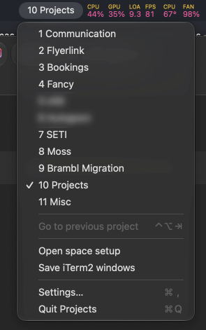
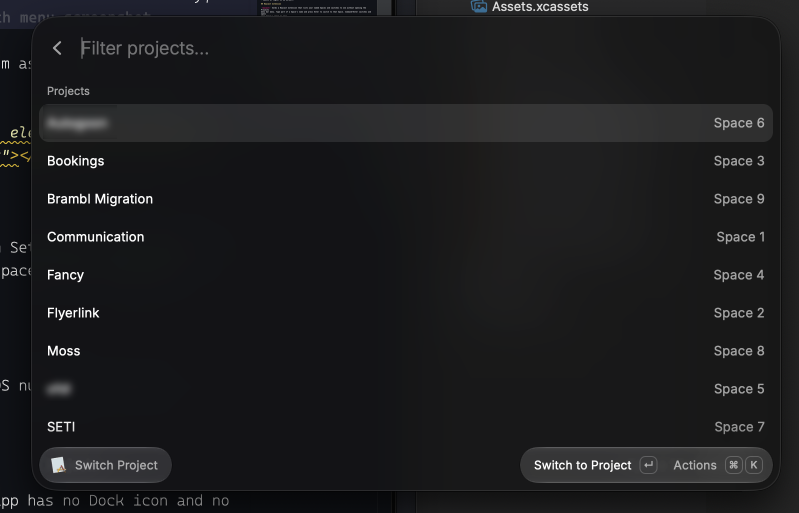

# Projects

Projects is a macOS menu bar app for people who keep one Space per project and run many Spaces. Running an agent per project puts a terminal and a browser window on each Space, and the count of Spaces grows with the count of projects.

You give each Space a name in the app. The menu bar item shows the number of the current Space and that name, for example "7 Website". When you switch Space, the Space's name appears in large white text in the middle of the primary display, then fades out. The menu lists every Space; clicking one switches to it.

For each Space you can save the positions of your iTerm2 windows and reopen them later in a chosen directory, and open a Chrome window with a list of URLs.

The repository also holds a Raycast extension, which lists your projects, filters them as you type, and switches to the one you pick. Give the extension's command a Raycast alias. To switch to a project, type that alias, then a few letters of the project's name, then Enter. The extension matches on the name, so you never type the Space number.

<p align="center"></p>

<p align="center"></p>

<p align="center"></p>

## Requirements

- macOS 14 Sonoma or later, with "Displays have separate Spaces" turned off in System Settings > Desktop & Dock. The app reads the Spaces of the first display only, so with "Displays have separate Spaces" on, the other displays' Spaces are misreported.
- Xcode 26 or later to build.
- iTerm2 and Google Chrome, for the window features.

Spaces are created in Mission Control (Control+Up, then the + at the top right). macOS numbers them left to right.

## Building and first run

Open `app/Projects.xcodeproj` and press Run. The menu bar item appears at once; the app has no Dock icon and no main window.

The project file sets no signing team. Xcode signs the build to run locally, which is all the app needs. To sign with your own Apple Developer team instead, create a file named `Local.xcconfig` next to `app/Projects.xcodeproj` containing `DEVELOPMENT_TEAM = <your team ID>`; the file is git-ignored.

A Run build is enough to keep using the app. Archive only to install a copy outside Xcode: Product > Archive, Distribute App > Custom > Copy App, then move `Projects.app` to `/Applications`.

Sources are in `app/src/`, tests in `app/tests/`. The Raycast extension is in `raycast/`, with its own sources and tests.

Run the app's tests with Product > Test in Xcode. The root `package.json` runs the app and the extension from the command line. The root `package.json` declares no dependencies, so the root needs no `npm install`.

```sh
npm test                   # both suites
npm run app:test           # the app's suite alone
npm run app:build          # build the app without running its tests
npm run raycast:test       # the extension's suite alone
npm run raycast:typecheck  # TypeScript over the extension
npm run raycast:dev        # install the extension into Raycast and rebuild on every save
```

`npm test` runs `scripts/test.mjs`, a harness over both suites, rather than either suite's own runner. `scripts/test.mjs` prints one line per test and nothing else, runs both suites even when the first suite fails, and repeats every failure at the end with its reason and the file and line it came from.

## Permissions

- Sending the keystrokes that switch Space needs the Accessibility permission. The app prompts the first time you click a Space in the menu.
- Opening iTerm2 and Chrome windows needs the Automation permission for each app. The app prompts on first use.

If you deny a prompt, or a grant stops working after a rebuild from Xcode, go to System Settings > Privacy & Security > Accessibility (or > Automation) and toggle Projects off and on.

## How switching works

The app switches Space by sending the keyboard shortcut macOS assigns to "Switch to Desktop N".

Those shortcuts are off by default. Enable them in System Settings > Keyboard > Keyboard Shortcuts > Mission Control. macOS lists one per Space that exists; desktops beyond 9 have no key assigned until you set one.

The app reads the shortcuts from the system. The Shortcuts tab in Settings lists them and shows "Not set — switching will not work" for any Space without one. To give a Space a shortcut, tick that Space's "Switch to Desktop N" entry in the Mission Control list and assign a key.

## Setting up a Space

Open Settings from the menu, or press Command+comma while the menu is open. The Spaces tab lists every Space; click one to edit it.

- Name: shown in the menu bar and the overlay. Left blank, the Space shows as "Desktop N".
- "Open iTerm2 windows" shows a directory field (blank means your home folder), a "Save current windows" button, the count of saved windows, and "Forget".
- "Open Chrome window" shows a list of URLs with add, remove and reorder. URLs must start with `http://` or `https://`.

Menu > "Save iTerm2 windows" records the position of every iTerm2 window on the current Space. It is enabled only when "Open iTerm2 windows" is on for that Space.

Menu > "Open space setup", or Control+Shift+= from anywhere, opens the saved iTerm2 windows in the directory and a Chrome window with the URLs. Opening the space setup again opens only what is missing. Control+Shift+= can be changed in Settings > Shortcuts.

## General settings

- Overlay duration slider, 0.3 to 5 seconds.
- Launch at login, on by default.

## Raycast extension

`raycast/` holds a Raycast extension that lists your named Spaces and switches to one without opening the Projects
menu bar menu. Type part of a Space's name and press Enter to switch to that Space. Command+Enter switches and opens
that Space's setup as well.

The list shows only Spaces you have named, alphabetically, with the Space number beside each. The Space you are on is
tagged "current" and sorts after every other Space. A Space with no Mission Control shortcut cannot be switched to, so
it is listed separately; pressing Enter on that Space opens the System Settings pane where you assign the shortcut.

The extension reads its list from Projects itself over AppleScript, so Projects must be running. The first time the extension asks
Projects for the list, macOS raises an Automation prompt asking whether Raycast may control Projects. Grant the
Automation permission in System Settings > Privacy & Security > Automation. Rebuilding Projects from Xcode can revoke
the permission. Grant it again in System Settings > Privacy & Security > Automation.

The extension is not in the Raycast Store, so you install the extension from source. Both commands below run from the
root of the repository.

`npm install` fetches the extension's dependencies. Run `npm install` once, and again whenever those dependencies
change.

```sh
npm install
```

`npm run raycast:dev` puts the Switch Project command into Raycast and rebuilds that command on every save.

```sh
npm run raycast:dev
```

Raycast loads the rebuilt command the next time you open Switch Project. Leave `npm run raycast:dev` running while you
work on the extension, and stop `npm run raycast:dev` with Control+C when you have finished.

The command appears in Raycast as "Switch Project" while `npm run raycast:dev` runs, and remains installed after
`npm run raycast:dev` stops. To reach the command by typing `p`, open Raycast's settings, find the command under
Extensions, and set an alias. The alias is stored in your Raycast settings and is not part of the extension.

## Where data is stored

Space setups are stored in `~/Library/Application Support/uk.co.29degrees.projects/projects.json`. If `projects.json` cannot be read, the app renames it to `projects.json.broken-<timestamp>` and starts with no setups.

## Caveats

- Finding the current Space relies on a private macOS function. A macOS update could break it, in which case the menu shows "–" and an empty list.
- Not built for the App Store: the app is unsandboxed and uses a private API.
